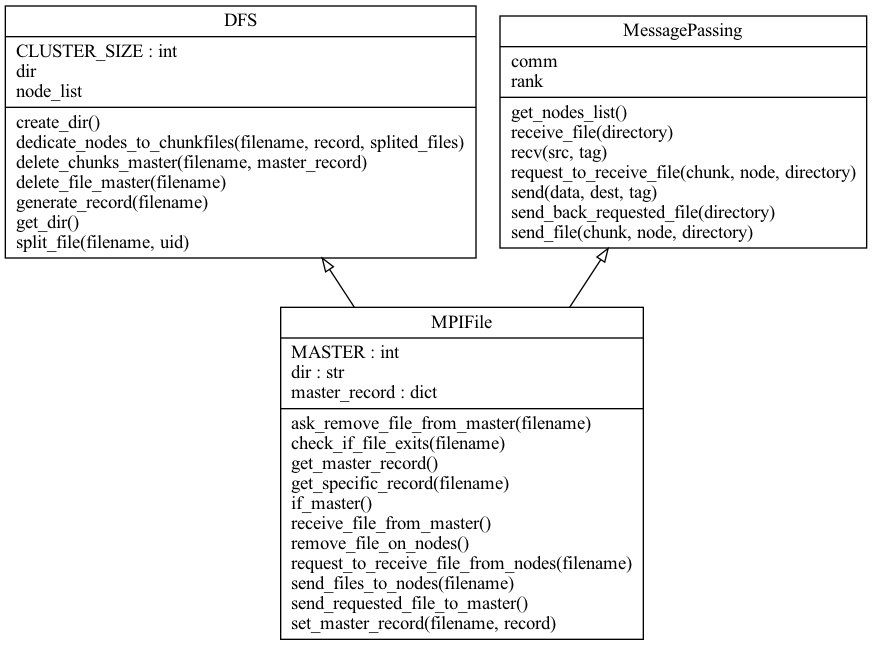

# MPIFile

An API based on Flask, it receives files, shurd and send chunks to its nodes via MPI.


---

## Server

```
mpirun -n <nodes> python3 main.py
```

## Client

```
python3 client.py

1) upload
2) list
3) Download
4) remove
5) exit
Choice:
```

---

## UML Diagram:



